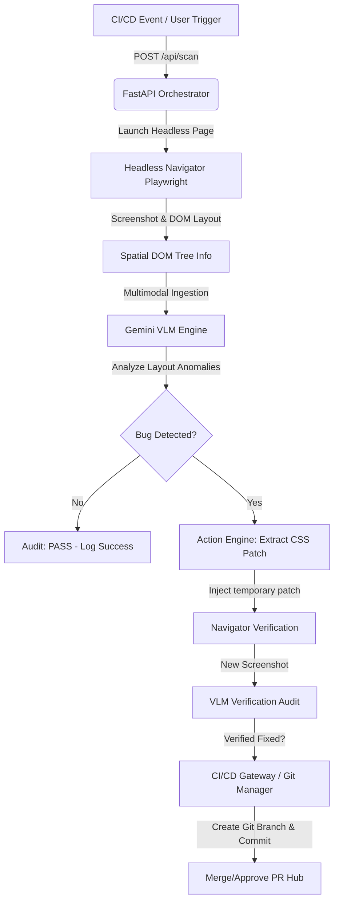

# OmniSight Technical Documentation: Week 1 & Week 2

This document provides a comprehensive technical breakdown of **OmniSight's** architecture, core modules, implementation details, and execution logic completed during **Week 1** and **Week 2** of development.

---

## System Architecture Overview

OmniSight is an autonomous self-healing QA pipeline that replicates the decision-making loop of a human QA engineer. Rather than relying on rigid DOM selectors (which break when class names or structures change), OmniSight uses a **headless browser navigator**, a **simplified spatial DOM tree extractor**, and a **Vision-Language Model (Gemini VLM)** to analyze visual correctness, generate CSS fixes, verify the fixes in the browser, and automatically raise a Pull Request.



---

## Week 1: Browser Automation & API Scaffolding

The focus of Week 1 was establishing the automated browser navigation layer and creating the web server scaffolding to receive triggers and serve the QA control dashboard.

### 1. Headless Navigator (`navigator.py`)
The [Headless Navigator](file:///c:/Users/Prapul%20Yeluri/Desktop/project%20of%20new/backend/navigator.py) is implemented using Python's asynchronous Playwright API. Its core responsibilities include:
*   **Context Isolation:** Launching headless Chromium instances with custom device emulation (width, height, user-agent) to audit mobile vs. desktop responsive layouts.
*   **State Capture:** Taking high-resolution full-page screenshots of pages before and after injecting CSS fixes.
*   **Spatial DOM Extraction:** Running evaluation scripts in the browser page context to construct a clean structural representation of visual elements.

#### Spatial DOM Tree Extraction Algorithm (`_extract_dom_tree`)
To prevent token bloat and filter out irrelevant layout data, `PlaywrightNavigator` runs a client-side JavaScript routine. This routine collects coordinates and computed styles for target tags:
```javascript
const tags = ['input', 'button', 'label', 'h1', 'h2', 'h3', 'h4', 'p', 'span', 'form', 'section', 'header', 'footer', 'div'];
```
Elements are filtered based on the following rules:
1.  **Size Filtering:** Elements with a width or height of `0` are ignored.
2.  **Structural Div Filtering:** Only divs acting as critical layout boundaries (e.g. `.checkout-action-wrapper`, `.cart-item`, `.form-group`) are recorded.
3.  **Style Properties:** Retrieves calculated layout attributes: `position`, `display`, `color`, `backgroundColor`.
4.  **Visible Bounding Box:** Captures precise browser viewport bounds (`x`, `y`, `width`, `height`) using `getBoundingClientRect()` to evaluate overlapping or viewport overflow.

---

### 2. API & Gateway Scaffolding (`app.py`)
The [CI/CD Gateway](file:///c:/Users/Prapul%20Yeluri/Desktop/project%20of%20new/backend/app.py) is built on FastAPI. It coordinates data transfers between the Playwright driver, VLM Engine, Git Manager, and the React front-end.

#### Key APIs & Interfaces:
*   **`POST /api/scan`**: Ingests a JSON payload detailing the requested target page scan:
    ```json
    {
      "bug_type": "clipping",
      "viewport": "mobile"
    }
    ```
    This triggers the async orchestrator loop, capturing state, executing VLM analysis, applying fixes, and returning the audit record.
*   **`GET /api/prs`**: Exposes list of auto-generated pull requests.
*   **`POST /api/prs/{pr_id}/action`**: Triggers git branch merging or rejection based on QA manager actions ("merge" or "decline").
*   **`DELETE /api/prs/{pr_id}`**: Discards a PR and deletes it from memory/disk.

#### Persistence Layer (`db.json`):
To prevent data loss during hot-reloads or server restarts, a lightweight JSON flat-file database has been integrated:
*   `_load_db()`: Reads history, active PRs, and increment counters from `static/db.json` on startup.
*   `_save_db()`: Writes state snapshots after every scan, PR status mutation, or delete operation.

---

## Week 2: Multimodal Prompting & Action Engine

Week 2 integrated visual reasoning capabilities to locate layout anomalies and map them directly to executable CSS repair code blocks.

### 1. Multimodal VLM Prompt Engineering (`vlm_agent.py`)
The [VLM Engine](file:///c:/Users/Prapul%20Yeluri/Desktop/project%20of%20new/backend/vlm_agent.py) feeds both the raw layout screenshot and the extracted DOM coordinate tree into **Gemini 1.5 Flash**. 

#### Prompt Engineering Strategy
The VLM is prompted with high-density system instructions designed to yield structured JSON output containing the reasoning and the fix:
```
You are an autonomous UI/UX QA engineer. You are analyzing a webpage to detect visual layout bugs.
Here is the simplified spatial DOM tree:
[DOM coordinates and CSS properties]

Analyze the screenshot image together with the DOM tree. The active bug context is: {bug_context}.

Your task:
1. Find the element that is layout-broken (e.g. clipping, overlapping, bad contrast, hidden).
2. Propose a targeted CSS fix to repair this element's layout.

Return your response strictly as a JSON object with this format:
{
    "detected": true,
    "description": "Short explanation of what is visually broken",
    "reasoning": "Step-by-step logic detailing why it is broken based on viewport size, coordinates, or styles.",
    "suggested_css": "The exact CSS code required to fix the layout. Target the class or element directly."
}
```

By requesting `response_mime_type="application/json"` from Gemini, the VLM natively outputs a valid JSON string, eliminating natural language conversational text and ensuring the code blocks are easily isolated.

---

### 2. Action Engine & Simulation Fallsback
In the absence of a `GEMINI_API_KEY`, the agent automatically switches to high-fidelity **Simulation Mode** to mimic VLM visual reasoning for four deliberate injected bugs:

1.  **Checkout Button Clipping (Mobile)**
    *   *Symptom:* Checkout button positioning places it beyond the viewport edge (`right: -120px`), rendering it invisible/cllipped on mobile.
    *   *VLM Logic:* Identifies that viewport boundary is `390px` but the checkout button's right bound exceeds `390px`.
    *   *CSS Fix:* Forces static layout block placement with full container width:
        ```css
        .checkout-btn.bug-clipping {
            position: static !important;
            width: 100% !important;
            margin-top: 1.5rem !important;
        }
        ```
2.  **Form Description Overlap (Global)**
    *   *Symptom:* Form subtitle collides with section title due to negative margin tweaks (`margin-top: -32px`).
    *   *VLM Logic:* Detects overlapping vertical coordinates between `h2` and `p`.
    *   *CSS Fix:* Reverts absolute offsets to restore natural block display flows:
        ```css
        .section-desc.bug-overlap {
            position: static !important;
            margin-top: 0.5rem !important;
        }
        ```
3.  **Low Color Contrast (WCAG Accessibility)**
    *   *Symptom:* Light grey text (`#cbd5e1`) on white background (`#f1f5f9`) yields contrast under 4.5:1.
    *   *VLM Logic:* Checks color codes against the background values and flags WCAG AA failure.
    *   *CSS Fix:* Applies slate text colors to satisfy contrast guidelines:
        ```css
        .summary-totals.bug-contrast { color: #475569 !important; }
        .summary-totals.bug-contrast .total-highlight { color: #0f172a !important; }
        ```
4.  **Hidden submit Button (RPA block)**
    *   *Symptom:* Crucial action button has `display: none !important` applied.
    *   *VLM Logic:* Scans DOM for interactive element states and flags non-rendered blocks.
    *   *CSS Fix:* Forces browser display back:
        ```css
        .checkout-btn.bug-hidden { display: block !important; }
        ```

---

## Verifying and Running the Application

### Startup Instructions
Both servers run concurrently:
1.  **FastAPI Backend (Port 8000)**
    *   Command: `..\.venv\Scripts\python.exe app.py` (executes within the `backend` folder).
    *   *Windows Event Loop Configuration:* Includes automatic configuration for subprocess support:
        ```python
        if sys.platform == "win32":
            asyncio.set_event_loop_policy(asyncio.WindowsProactorEventLoopPolicy())
        ```
2.  **Vite Dashboard (Port 5173)**
    *   Command: `npm run dev` (executes within the `dashboard` folder).
    *   Open `http://localhost:5173` to control the application.

---
*Created and maintained by the OmniSight QA automation team.*
